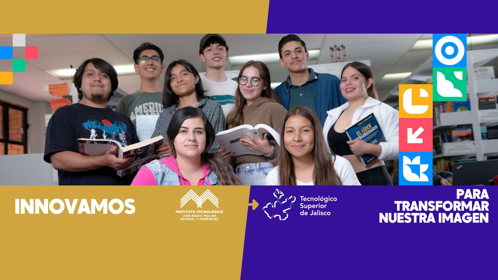

# TecTechSpin
Repositorio educativo diseñado para facilitar la gestión de proyectos tecnológicos con el objetivo de generar spin-offs exitosos en ITJMMPyH.

El recurso "TecTechSpin" representa una herramienta integral para la capacitación en la gestión de proyectos de base tecnológica con enfoque en la generación de spin offs. Su desarrollo ha involucrado una cuidadosa planificación, investigación y utilización de tecnologías avanzadas para garantizar su efectividad y relevancia en el ámbito actual de la tecnología y el emprendimiento.

Los proyectos de base tecnológica pueden convertirse en spin-offs exitosas al validar el concepto, desarrollar una tecnología sólida, establecer un modelo de negocio sostenible, proteger la propiedad intelectual, buscar colaboraciones estratégicas y gestionar eficientemente todos los aspectos relacionados con la creación y crecimiento de la empresa.

# Sistema de Gestión de Proyectos de Base Tecnológica

<!-- wp:paragraph -->

Este Sistema de Gestión de Proyectos le permite al usuario administrador:

<!-- /wp:paragraph -->

<!-- wp:list -->
<ul><li>Listar, Ver, Editar y Eliminar los Proyectos a gestionar</li><li>Listar, Ver, Editar y Eliminar Empleados para los Proyectos</li><li>Listar, Ver, Editar y Eliminar Usuario de tipo Staff y Administrativo</li><li>Visualizar he Imprimir los reportes de tiempo trabajado por Proyecto</li><li>Visualizar he imprimir los reportes de tiempo trabajado por Empleado</li><li> Visualizar he imprimir los reportes de tiempo trabajado por Proyecto y Empleado</li><li> Listar, Ver, Editar y Eliminar Los tipos de trabajo asignados a los Empleados</li><li>Cambiar las configuraciones del Sistema,, nombre, nombre corto, logo del sistema y banner</li></ul>
<!-- /wp:list -->

<!-- wp:paragraph -->

El usuario de tipo Staff únicamente tiene la facultad de gestionar los reportes, los proyectos, los empleados y sus tipos de trabajo, no crea usuarios de tipo staff ni admin. 

<!-- /wp:paragraph -->

<!-- wp:paragraph -->

El usuario final de perfil empleado, puede visualizar he imprimir los proyectos, sus reportes de tiempo trabajado, y el tiempo total asignado por Proyecto.

<!-- /wp:paragraph -->

# Importante

La aplicación puede presentar inconsistencias de disponibilidad, solo espera a que el servidor de la organizacion responda.

# Enlace demo de la aplicación

https://leonramos.com/proyectos/admin/login.php
Usuario: configuroweb
Clave: 1234abcd..

# Contacto

Jefatura de Division del ITJMMPyH en Sistemas Computacionales
https://www.tecmm.edu.mx/

